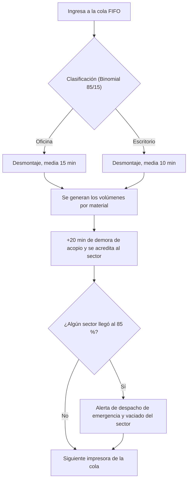

# Simulador Ecofimática

Simulador web de eventos discretos para anticipar la saturación de los sectores de almacenamiento de materia prima recuperada del desmontaje de impresoras y scanners (e-waste).

Trabajo Final Integrador de **Simulación** — UTN FRT, Comisión 4K3 (Grupo 1), junio de 2026.

**[Ver demo en vivo](https://tfi-simulacion-wine.vercel.app/)**

> Proyecto académico. Toma como caso de estudio la operación documentada de Fundación Ecofimática (gestionada por Recyclia), pero no tiene ninguna relación oficial con la fundación. Los parámetros salen de fuentes bibliográficas, no de datos internos de la planta.

## Qué problema resuelve

Antes de desarmar un lote de impresoras, el responsable de planta ingresa dos datos (cantidad de impresoras y espacio disponible) y el simulador le devuelve:

- En qué sector del depósito (Plásticos, Metales Ferrosos, Metales No Ferrosos, PCBs o Cables) se llega primero al umbral crítico del **85 %** de ocupación.
- Cuánto tiempo va a tomar desmontar el lote completo.
- El porcentaje de ocupación total y por sector, la capacidad restante y las advertencias automáticas, con una visualización 3D del depósito.

Está pensado para un perfil no técnico (gerente administrativo de planta): no hace falta entender de simulación ni de estadística.

## Cómo funciona el modelo

Cada impresora recorre este flujo:



**Regla central de control:** si el volumen acumulado de un sector alcanza o supera el 85 % de su capacidad, se dispara un despacho de emergencia que retira todo el material de ese sector.

| Sector | Proporción del material | Distribución del volumen |
|---|---|---|
| Plásticos | 40 % | Normal |
| Metales ferrosos | 25 % | Uniforme |
| Metales no ferrosos | 15 % | Uniforme |
| Placas electrónicas (PCBs) | 10 % | Uniforme |
| Cables y conectores | 10 % | Uniforme |

## Arquitectura del motor

El motor está escrito en **TypeScript** y organizado en cinco capas, inspiradas en Diseño Orientado al Dominio, para poder cambiar parámetros o agregar sectores sin reescribir el cálculo:

| Capa | Responsabilidad |
|---|---|
| 1. Dominio | Entidades del proceso: impresoras (Oficina o Escritorio), sectores con su volumen y capacidad, límites del sistema |
| 2. Motor estocástico | Generador congruencial propio (sin librerías de caja negra), distribuciones Binomial, Normal y Uniforme, y Transformada Inversa |
| 3. Motor de simulación | Reloj de eventos discretos, cola de impresoras y lógica de procesamiento de cada equipo |
| 4. Resultados y estadísticas | Calcula ocupación por sector, volumen total y tiempo de procesamiento, sin modificar el estado del motor |
| 5. Integración y alertas | Traduce el estado interno a un formato simple para la interfaz y gestiona las alertas del umbral del 85 % |

### Decisiones de diseño

- **Eventos discretos:** el reloj avanza exactamente lo que dura cada tarea, no en intervalos fijos.
- **Semilla fija:** una semilla dinámica (basada en la hora) hacía los resultados irreproducibles. Con semilla fija, los mismos parámetros dan siempre el mismo resultado, lo que permite depurar y auditar.
- **Normal para el plástico:** se empezó con una distribución Uniforme y se corrigió, porque en un proceso de manufactura la mayoría de las piezas está cerca del promedio.
- **Demora de acopio de 20 minutos** entre el desarmado y el guardado, para no sobreestimar la velocidad de almacenamiento.

## Tecnologías

- **TypeScript** (motor de simulación)
- **Next.js** y **React** (aplicación web)
- **React Three Fiber** / Three.js (visualización 3D del depósito)
- **Vercel** (despliegue)

## Pruebas

La suite automatizada tiene **18 casos de prueba**. Verifica que las distribuciones devuelvan valores dentro de los rangos esperados, que la regla del 85 % dispare la alerta cuando corresponde y que el reloj avance de forma consistente con los tiempos de servicio.

## Cómo correrlo localmente

```bash
git clone https://github.com/NadiaEnoaRizoAvalos/TFI_Simulacion.git
cd TFI_Simulacion
npm install
npm run dev
```

Después abrí `http://localhost:3000`. Para correr las pruebas: `npm test`.

## Alcance

**Incluido:** capacidad del depósito, división en sectores, flujo de ingreso de impresoras por lote, volumen generado por el desmontaje y monitoreo de ocupación.

**No incluido en esta versión:** logística externa de recolección, comercialización y precios de los materiales, y el detalle químico de la descontaminación de tóneres y tintas.

## Posibles mejoras

- Calibrar los parámetros (porcentajes, tiempos de desmontaje, umbral) con datos operativos reales.
- Conectar la capa de integración a un sistema de registro para comparar lo simulado contra lo ocurrido.
- Sumar un historial de corridas para comparar la ocupación entre lotes.

## Equipo

Equipo de simulación, Grupo 1, Comisión 4K3 — UTN Facultad Regional Tucumán.

| Integrante | Área |
|---|---|
| Chaile Franco, Miguel Alejandro | Modelo verbal y reglas de decisión |
| Delgado, Johana Elena | Recolección de datos y parametrización |
| Fuentes García, Franco Nicolás | Motor estocástico y distribuciones de probabilidad |
| Rizo Ávalos, Nadia Enoa | Arquitectura del motor de simulación y eventos discretos |
| Rodríguez, Héctor Martín | Interfaz de usuario y experiencia del cliente final |
| Soria, Leandro Miguel | Validación, pruebas y próximos pasos |
